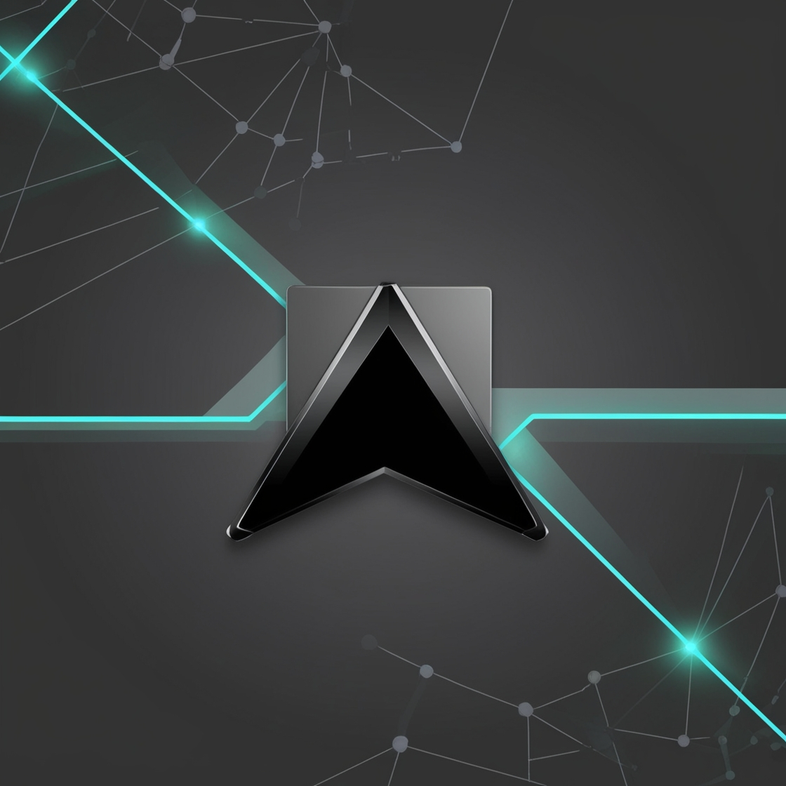

# AR Game - Connect the Lines

A mobile AR-based game where the main goal is to connect lines in a network-like pattern. The centerpiece of the gameplay is a sleek, black arrow-shaped desktop cursor that interacts with the environment. The game's immersive design and AR features make it a unique and enjoyable experience.

---

## Features
- **AR-Based Gameplay:** Interact with the real world through augmented reality.
- **Cursor Interaction:** Use a desktop-style arrow cursor to connect lines.
- **Minimalistic Design:** A sleek and futuristic interface.
- **Engaging Puzzles:** Challenge yourself to complete each level by connecting the lines.
- **Gyroscope Integration:** The iconic cursor dynamically interacts with the game space using gyroscope sensors.
- **Flat Surface Detection:** A custom algorithm detects flat surfaces to place the game area accurately.

---

## Installation
1. Clone the repository:
   ```bash
   git clone https://github.com/yourusername/ar-game.git
   ```
2. Open the project in Android Studio.
3. Build and run the application on your Android device.

---

## Technologies Used
- **Kotlin** for building the mobile application.
- **ARCore** for augmented reality functionality.
- **Gyroscope APIs** for cursor movement and interaction.
- **Custom Algorithms** for flat surface detection and placement.

---

## How to Play
1. Launch the application on your mobile device.
2. Point your device to a flat surface to initialize the AR environment.
3. Observe how the game uses an arrow-shaped desktop cursor to interact dynamically within the space.
4. Connect the dots by drawing lines between them, forming various shapes or patterns.
5. Complete the puzzle to move on to the next challenge.

---

## Technical Details
- **Cursor Mechanics:** The cursor mimics the desktop arrow pointer, allowing precise interactions with the virtual game elements. It is controlled via gyroscope sensors, making the gameplay responsive and interactive.
- **Flat Surface Detection:** The game incorporates a custom algorithm to scan and detect flat surfaces, ensuring the game area is properly anchored to the physical environment.
- **Puzzle Design:** Each level contains dots that need to be connected in specific patterns, offering a progressively challenging experience.

---

## Contribution
Contributions are welcome! Feel free to fork this repository and submit pull requests with improvements or new features.

---

## License
This project is licensed under the MIT License. See the [LICENSE](LICENSE) file for details.

---

## Contact
For any inquiries, please contact [ArdaCan](mailto:ardacanuysal03@gmail.com).

Enjoy the game!
